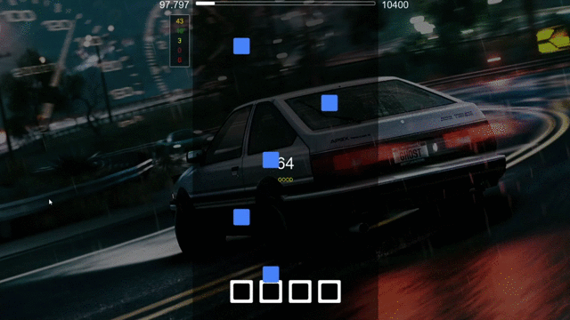

# URG

Untitiled Rhythm Game (URG) is a simple, four-lane rhythm game. Hit notes coming down the screen that correspond to rhythmic events in songs. 

This project is one I made for fun in JavaFX. This was mostly just to see if I had the chops to make a game from scratch (base JavaFX is not really suited for games), so I might use this as a basis for a more creative one down the line, maybe created with an actual game framework. 

## How to Play 

A manual for how to use the program is located in `/manuals/User Manual.pdf`

## Necessary Installation

For this project to work, you'll need to install the Maven package manager.

## Script File Usage 

There are 2 script files for you to use. Each has a `bat` and `bash` equivalent

- `run` runs the program
- `javadoc` creates the javadoc files 

In order to correctly use the scripts, run them from the outermost directory, e.g. `bash ./scripts/run.bash` 
